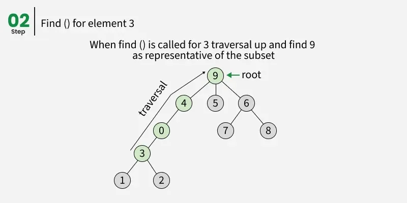
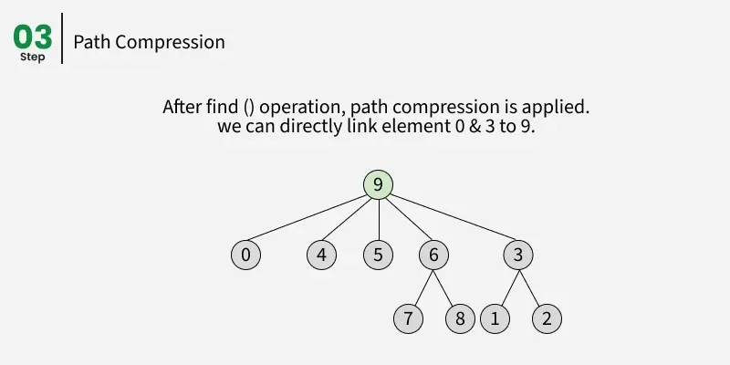

# Two sets are called disjoint sets if they don't have any element in common. The disjoint set data structure is used to store such sets. It supports following operations:

* Merging two disjoint sets to a single set using **Union** operation.  
* Finding representative of a disjoint set using **Find** operation.
* Check if two elements belong to same set or not. We mainly find representative of both and check if same.

## data structure

**Array**:
the i'th element of the Parent[] array is the parent of the i'th item.  
**Tree**:
The root node (or the topmost node) of each tree is called the representative of the set.  
## Optimization 
* Path compression (Used to improve find()):  
   * The idea is to flatten the tree when find() is called. When find() is called for an element x, root of the tree is returned. The find() operation traverses up from x to find root. The idea of path compression is to make the found root as parent of x so that we don’t have to traverse all intermediate nodes again. If x is root of a subtree, then path (to root) from all nodes under x also compresses.
   
   
* Union by Rank (Modifications to union()):  
   * Rank is like height of the trees representing different sets. We use an extra array of integers called rank[]. The size of this array is the same as the parent array Parent[]. If i is a representative of a set, rank[i] is the rank of the element i.  Rank is same as height if path compression is not used. With path compression, rank can be more than the actual height.Now recall that in the Union operation, it doesn’t matter which of the two trees is moved under the other. Now what we want to do is minimize the height of the resulting tree. If we are uniting two trees (or sets), let’s call them left and right, then it all depends on the rank of left and the rank of right. 
        
        * If the rank of left is less than the rank of right, then it’s best to move left under right, because that won’t change the rank of right (while moving right under left would increase the height). In the same way, if the rank of right is less than the rank of left, then we should move right under left.  
        * If the ranks are equal, it doesn’t matter which tree goes under the other, but the rank of the result will always be one greater than the rank of the trees.
    * Instead of using **rank** (height) as stardard to modify the tree we can also use **size**
    
    
    
